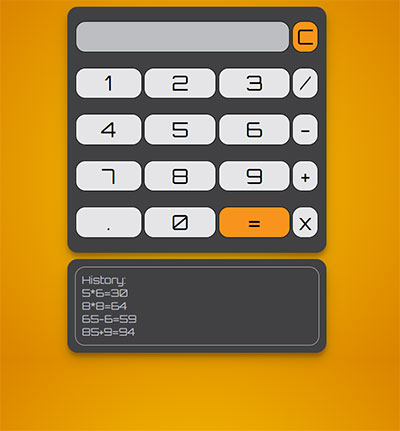

# Calculator

This is a simple calculator with history.

## Table of contents

- [Overview](#overview)
  - [Screenshot](#screenshot)
  - [Links](#links)
- [My process](#my-process)
  - [Built with](#built-with)
- [Author](#author)

## Overview

Users should be able to:

- View the optimal layout for the app depending on device's screen size
- Perform the actions and view the results
- See the result in history block

### Screenshot

### Links

- Live Site URL: [Simple Calculator with history](https://cookiemonstersopot.github.io/Calculator/)

## My process

### Built with

- HTML
- CSS custom properties
- JavaScript

## Author

- GitHub - [@CoockieMonster](https://github.com/CookieMonsterSopot)
